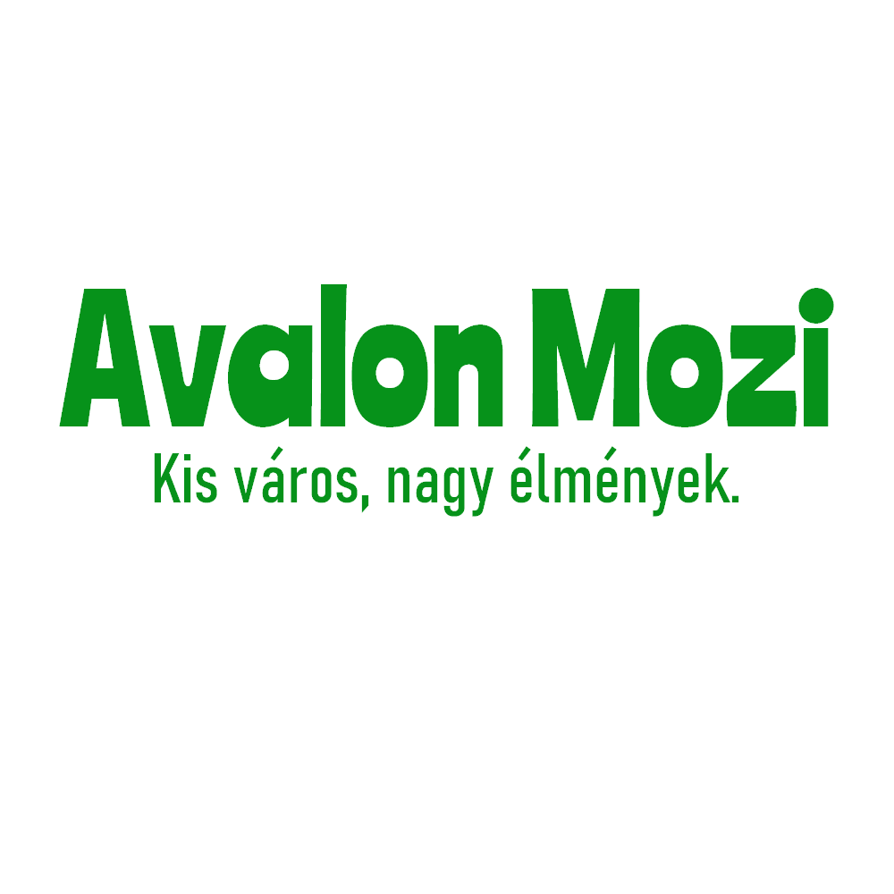

# Avalon Mozi - Arculati kézikönyv

## Elnevezések

Az Avalon Mozi és a hozzá társuló elektronikus jegyfoglalási rendszer esetében a következő elnevezések használhatóak:
- Avalon Mozi
- Avalon Mozi Jegyrendszer
- Avalon Mozi e-jegy rendszer
- Avalon Mozi Elekronikus Jegyfoglalási Rendszer

## Szlogenek

Az Avalon Mozi egyetlen hivatalos szlogenje a következő: **"Kis város, nagy élmények."**

A szlogen használható kijelentő formában (ponttal a mondat végén), felkiáltó formában (felkiáltó jellel a mondat végén) valamint naturálisan, mondatvégi írásjel nélkül is.

## Logó

Ebben a fejezetben az engedélyezett logókat mutatjuk be.

Fontos, hogy a logókat illetően nincs kötelező megkötés a használatukat illetően, a legfontosabb irányelv az az, hogy a helyzetnek megfelelően a lehető legesztétikusabb verziót kell alkalmazni.

### Négyzetalakú logók (1:1-es képarány)


*Nem transzparens, színes logó*


*Transzparens, színes logó*


*Transzparens, fekete logó*


*Transzparens, fehér logó*

### Téglalap alakú logók (16:9-es képarány)


*Nem transzparens, színes logó*


*Transzparens, színes logó*


*Transzparens, fekete logó*


*Transzparens, fehér logó*


## Színek

Elsődleges szín, sötétzöld: HEX #069215, rgb(6, 146, 21)
Másodlagos szín, sárga: HEX #fff25a, rgb(255, 242, 90)

Továbbiakban a fekete (HEX #000000, rgb(0,0,0)) és a fehér (HEX #ffffff, rgb(255,255,255)) színek vannak előre elfogadva arculatilag.

Az elsődleges szín árnyalatai a következők:


Ehhez a [*Tint & Shade Generator*](https://maketintsandshades.com/#069215) weboldalt vettük igénybe.

A forráskódban így definiáltuk a presetet:

```typescript
const customPreset = definePreset(Aura, {
  semantic: {
      primary: {
          50: '#83c98a',
          100: '#6abe73',
          200: '#51b35b',
          300: '#38a844',
          400: '#1f9d2c',
          500: '#069215',
          600: '#058313',
          700: '#057511',
          800: '#04660f',
          900: '#04580d',
          950: '#03490b'
      }
  }
});
```

## Betűtípus

A logó fő betűtípusa Ranchers. [Google Fonts - Ranchers](https://fonts.google.com/specimen/Ranchers)

A logó másodlagos betűtípusa Bahnschrift Condensed. [Microsoft Font List - Bahnshrift](https://learn.microsoft.com/en-us/typography/font-list/bahnschrift)

További megkötés nincs arculatilag a betűtípusokat illetően.