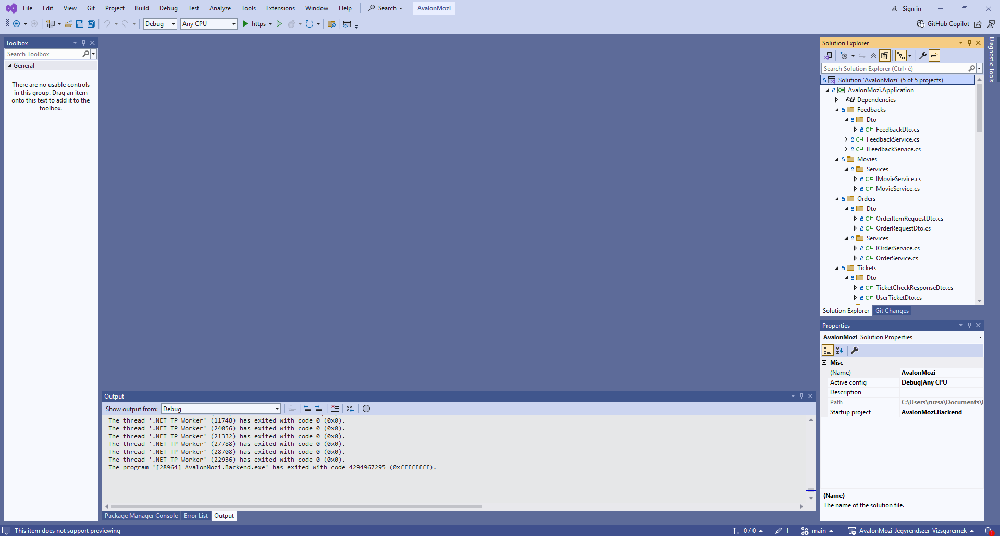
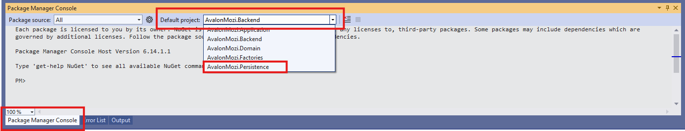

# Avalon Mozi Jegyrendszer - Telepítési útmutató

## Előkövetelmények

A rendszer elindításához szükség van a következő szoftverekre:
- Microsoft Dotnet 8.0 runtime
    - Amennyiben IIS alatt szeretnénk futtatni a rendszert, úgy szükség van a **Microsoft Dotnet 8.0 Hosting Bundle** szoftverre is.
- Node.Js keretrendszer (>= v22.18.0)
- Microsoft SQL Express/Developer/Datacenter/Enterprise

Amennyiben a rendszert fejlesztői környezetben indítanánk el, úgy szükség van a Visual Studio és Visual Studio Code szoftverekre is.

## Backend

### Appsettings fájl ellenőrzése

A telepítés és tesztelés előtt célszerű ellenőrizni az Appsettings.json fájlunkat. Ezzel tudjuk az adatbázis kapcsolatot valamint a JWT token adatait konfigurálni.

```json
{
  "Logging": {
    "LogLevel": {
      "Default": "Information",
      "Microsoft.AspNetCore": "Warning"
    }
  },
  "ConnectionStrings": {
    "DefaultConnection": "Server=localhost\\SQLEXPRESS;Database=AvalonMozi;Trusted_Connection=True;TrustServerCertificate=true;"
  },
  "Jwt": {
    "Issuer": "https://avalonmozi.testdev.hu",
    "Audience": "https://avalonmozi.testdev.hu",
    "Key": "QiVKByi0pT6AXJqqO7kLfZta4fJOO76Z",
    "DurationInMinutes":  "120"
  }
}
```

A `DefaultConnection` adatbázis kapcsolati sztringet ellenőrizzük le, hogy megfelel a saját üzemeltetési környezetünkhöz.

A JWT adatait szabadon átírhatjuk, biztonsági szempontból a kulcsot célszerű lecserélni.

Amennyiben publisholni akarjuk a projektet release configgal, úgy az appsettings tartalmát át kell másolni az appsettings.json fájlba az appsettings.development.json fájlból.

### Adatbázis migráció készítése

1. Nyissuk meg a Visual Studio szoftverben a backend solution (.sln) fájlját.

2. Nyissuk meg a Package Manager Console fület és váltsunk át az "Avalon.Persistence" projektre.

3. Adjuk ki az `add-migration Initial` parancsot.
4. Adjuk ki az `update-database` parancsot.

```
Fontos! Amennyiben az alapvető migrációtól eltérünk és új migrációt állítunk elő, úgy a solution fájlban ki kell kommentelni az NSwag konfigurációját, mert anélkül el fog akadni.
```
```XML
<Target Name="NSwag" AfterTargets="PostBuildEvent" Condition=" '$(Configuration)' == 'Debug' ">
    <Message Importance="High" Text="$(NSwagExe_Net80) run nswag.json /variables:Configuration=$(Configuration)" />
    <Exec WorkingDirectory="$(ProjectDir)" EnvironmentVariables="ASPNETCORE_ENVIRONMENT=Development" Command="$(NSwagExe_Net80) run nswag.json /variables:Configuration=$(Configuration)" />
    <Delete Files="$(ProjectDir)\obj\$(MSBuildProjectFile).NSwag.targets" />
</Target>
```

### Indítás

Amennyiben a kapcsolati sztringet leellenőriztük és rendelkezünk adatbázis migrációval, úgy a képernyő tetején található "Start" gombbal tudjuk elindítani a rendszert.

### Backend prod build

Amennyiben telepítésre szeretnénk lebuildelni a szoftvert, úgy a Visual Studio Publish funkcióját tudjuk használni.

## Frontend

### Environment fájl ellenőrzése

Használat előtt ellenőrizni kell az environment fájlokat. Ellenőrizzük az API elérési útját.

Az environment fájlokat a következő útvonalon találjuk: `\src\environments\`

```json
export const environment = {
    production: false,
    apiBaseUrl: "https://localhost:7285"
};
```

Production használat esetén a sima environment.json fájlba másoljuk át az environment.development.json tartalmát és vizsgáljuk felül az API útvonalát.

## Frontend

1. Töltsük le a csomagokat a következő paranccsal: `npm install`
2. Indítsuk el a frontendet a következő paranccsal: `npm start`

### Frontend prod build

Amennyiben production configban szeretnénk kész statikus fájlokat létrehozni telepítéshez, úgy a következő parancsot futtassuk: `ng build --configuration=production`